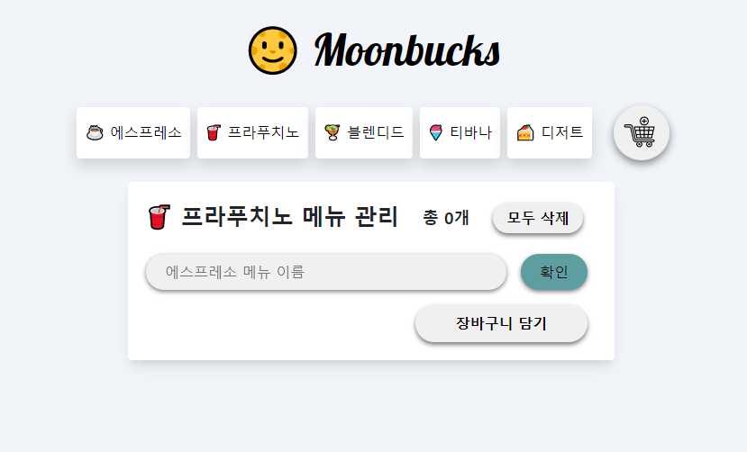

# 🌝 Moonbucks
> 문벅스 주문리스트

웹서버를 이용하여 카테고리 안에 메뉴별로 저장하고 장바구니에 담을 수 있는 카페 주문사이트입니다 .<br>
(웹서버를 local에 클론하지 않으면 실행되지 않습니다)

### 보러가기: <https://camac0808.github.io/Moonbucks>



## 프로젝트에 사용된 언어 및 라이브러리

* Javascript ES6
* Blackcoffee-study server api 사용

## 프로젝트의 기능 설명

### 1. 웹 저장소를 local에 clone 
```sh
git clone https://github.com/blackcoffee-study/moonbucks-menu-server.git
```

### 2. 저장소를 clone해준 후 의존성 라이브러리를 설치하고 서버를 동작시켜 로컬에서 실행
```sh
npm install
npm start
```

### 3. 로컬 url로 잡아주고 fetch하여 카테고리별로 저장하거나 장바구니에 담기
```sh
const URL = "http://localhost:3000/api"
```

## 정보

💌메일 – zqzwzazs@gmail.com - gomgom_@naver.com


## 기여 방법

1. (<https://github.com/camac0808/React-project/fork>)을 포크합니다.
2. (`git checkout -b feature/fooBar`) 명령어로 새 브랜치를 만드세요.
3. (`git commit -am 'Add some fooBar'`) 명령어로 커밋하세요.
4. (`git push origin feature/fooBar`) 명령어로 브랜치에 푸시하세요. 
5. 풀리퀘스트를 보내주세요.

<!-- Markdown link & img dfn's -->
[npm-image]: https://img.shields.io/npm/v/datadog-metrics.svg?style=flat-square
[npm-url]: https://npmjs.org/package/datadog-metrics
[npm-downloads]: https://img.shields.io/npm/dm/datadog-metrics.svg?style=flat-square
[travis-image]: https://img.shields.io/travis/dbader/node-datadog-metrics/master.svg?style=flat-square
[travis-url]: https://travis-ci.org/dbader/node-datadog-metrics
[wiki]: https://github.com/yourname/yourproject/wiki
